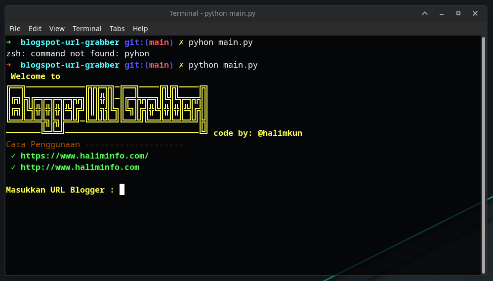

# Blogger Pos Url Grabber
Tools to retrieve all blogger / blogspot posts. made with **python**. You can try 

## Requirements

```
colorama 
feedparser
validators
```

Install requirements library for run the program
``` python
pip install colorama feedparser validators
```

## How to run

make sure you have installed the specified requirements,

then run the following command.
``` python
python main.py
```
